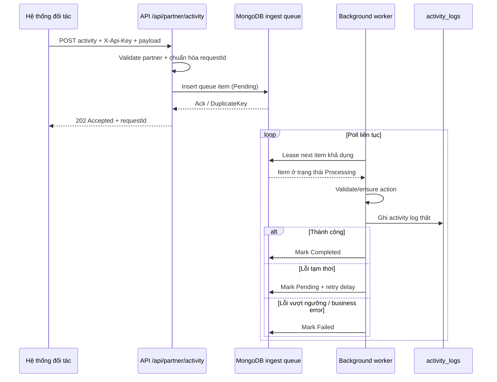

# Logging Activity

Hệ thống ASP.NET Core MVC kết hợp MongoDB để tiếp nhận activity log từ hệ thống khác qua API, lưu trữ tập trung, tra cứu, thống kê và cảnh báo theo ngưỡng cấu hình.

## Chức năng chính

- Đăng nhập bằng cookie authentication cho khu vực quản trị.
- Quản lý tài khoản và phân quyền `Admin`, `Auditor`.
- Quản lý partner tích hợp với API key riêng cho từng partner.
- Quản lý danh mục action log và cấu hình cảnh báo theo số log tối đa trong ngày.
- Dashboard tổng quan log theo ngày, partner và action.
- Màn hình `Log và thống kê` có lọc dữ liệu, phân trang và cảnh báo active trong ngày.
- Màn hình `Lịch sử cảnh báo` lưu lại toàn bộ cảnh báo đã phát sinh theo thời điểm.

## Cấu hình

File `LoggingActivity.Web/appsettings.json` chỉ giữ placeholder an toàn cho MongoDB connection string. Không lưu connection string thật trong source control.

Cách dễ nhất khi pull code sang máy khác là copy file mẫu `LoggingActivity.Web/appsettings.Local.example.json` thành file local riêng không commit vào git:

```json
{
	"MongoDb": {
		"ConnectionString": "mongodb://localhost:27017/logactivity",
		"DatabaseName": "logactivity"
	},
	"SeedAdmin": {
		"UserName": "admin",
		"Email": "admin@example.com",
		"Password": "Admin@123456"
	}
}
```

Ví dụ trên đã có sẵn trong file `LoggingActivity.Web/appsettings.Local.example.json`, bạn chỉ cần copy sang một trong hai tên file local bên dưới rồi thay lại giá trị thật.

Lưu file đó tại một trong hai tên sau:

- `LoggingActivity.Web/appsettings.Local.json`
- `LoggingActivity.Web/appsettings.Development.local.json`

Hai file này đã được ignore sẵn, nên mỗi máy có thể tự cấu hình riêng mà không ảnh hưởng repo.

Thiết lập các giá trị sau bằng user-secrets hoặc environment variables:

- `MongoDb:ConnectionString`: chuỗi kết nối MongoDB.
- `MongoDb:DatabaseName`: tên database nếu chuỗi kết nối chưa chứa sẵn database.
- `SeedAdmin:*`: tài khoản admin được tạo tự động khi khởi động lần đầu.

Ngoài file local ở trên, project cũng hỗ trợ các cách cấu hình quen thuộc sau:

- `MongoDb:ConnectionString`
- `ConnectionStrings:MongoDb`
- env var `MONGODB_URI`

Database name có thể lấy từ:

- `MongoDb:DatabaseName`
- env var `MONGODB_DATABASE`

Project đã bật `User Secrets`, nên với môi trường local cũng có thể cấu hình bằng lệnh:

```powershell
dotnet user-secrets set "MongoDb:ConnectionString" "<your-mongodb-connection-string>" --project .\LoggingActivity.Web\LoggingActivity.Web.csproj
dotnet user-secrets set "SeedAdmin:UserName" "admin" --project .\LoggingActivity.Web\LoggingActivity.Web.csproj
dotnet user-secrets set "SeedAdmin:Email" "admin@example.com" --project .\LoggingActivity.Web\LoggingActivity.Web.csproj
dotnet user-secrets set "SeedAdmin:Password" "<your-strong-password>" --project .\LoggingActivity.Web\LoggingActivity.Web.csproj
```

Nếu connection string của bạn chưa có phần database ở cuối URI, thêm tiếp:

```powershell
dotnet user-secrets set "MongoDb:DatabaseName" "logging_activity_db" --project .\LoggingActivity.Web\LoggingActivity.Web.csproj
```

Nếu trước đó đã có secret cũ, có thể kiểm tra hoặc ghi đè bằng:

```powershell
dotnet user-secrets list --project .\LoggingActivity.Web\LoggingActivity.Web.csproj
```

Nếu chạy trên server hoặc CI/CD, ưu tiên dùng environment variable:

```powershell
$env:MongoDb__ConnectionString = "<your-mongodb-connection-string>"
$env:SeedAdmin__UserName = "admin"
$env:SeedAdmin__Email = "admin@example.com"
$env:SeedAdmin__Password = "<your-strong-password>"
```

Chỉ cần thêm `MongoDb__DatabaseName` nếu connection string không tự chứa database name.

## Deploy qua GitHub Actions lên Linux VPS

Repo đã có workflow mẫu tại [.github/workflows/deploy-linux-vps.yml](.github/workflows/deploy-linux-vps.yml). Workflow này sẽ:

- build và publish project `LoggingActivity.Web`
- upload artifact publish
- copy artifact lên Linux VPS qua SSH
- restart service bằng `systemctl`

### 1. Tạo GitHub Secrets

Trong GitHub repo, vào `Settings -> Secrets and variables -> Actions` và tạo các secret sau:

- `VPS_HOST`: IP hoặc domain của server Linux
- `VPS_PORT`: cổng SSH, thường là `22`
- `VPS_USER`: user dùng để deploy
- `VPS_SSH_KEY`: private key SSH của user deploy
- `VPS_APP_PATH`: thư mục chứa app trên server, ví dụ `/var/www/loggingactivity`
- `VPS_SERVICE_NAME`: tên service systemd, ví dụ `loggingactivity`

### 2. Cấu hình app trên server

Ví dụ tạo file service tại `/etc/systemd/system/loggingactivity.service`:

```ini
[Unit]
Description=Logging Activity Web
After=network.target

[Service]
WorkingDirectory=/var/www/loggingactivity
ExecStart=/usr/bin/dotnet /var/www/loggingactivity/LoggingActivity.Web.dll
Restart=always
RestartSec=5
SyslogIdentifier=loggingactivity
User=www-data
Environment=ASPNETCORE_ENVIRONMENT=Production
Environment=ASPNETCORE_URLS=http://0.0.0.0:5137
Environment=MongoDb__ConnectionString=<your-mongodb-connection-string>
Environment=MongoDb__DatabaseName=logging_activity_db
Environment=SeedAdmin__UserName=admin
Environment=SeedAdmin__Email=admin@example.com
Environment=SeedAdmin__Password=<your-strong-password>

[Install]
WantedBy=multi-user.target
```

Sau đó trên VPS chạy:

```bash
sudo systemctl daemon-reload
sudo systemctl enable loggingactivity
sudo systemctl start loggingactivity
```

### 3. Luồng deploy

- push code lên nhánh `main`, hoặc chạy workflow thủ công bằng `workflow_dispatch`
- GitHub Actions sẽ build, publish, copy file lên VPS và restart service
- kiểm tra log service bằng lệnh `sudo journalctl -u loggingactivity -f`

### 4. Reverse proxy gợi ý

Nên chạy app sau Nginx. Ví dụ upstream tới `http://127.0.0.1:5137` rồi public domain qua Nginx để xử lý TLS/HTTPS ổn định hơn.

## Chạy ứng dụng

```powershell
dotnet restore
dotnet build .\LoggingActivity.Web\LoggingActivity.Web.csproj
dotnet run --project .\LoggingActivity.Web\LoggingActivity.Web.csproj
```

Tài khoản seed admin được tạo từ cấu hình `SeedAdmin:*` trong user-secrets hoặc environment variables.

## API tích hợp

Partner được cấu hình trong menu quản trị và hệ thống tự sinh API key riêng. Khi gọi API, partner phải truyền header:

```http
X-Api-Key: your-partner-api-key
```

Base endpoint:

```http
POST /api/partner/activity
GET  /api/partner/activity?page=1&pageSize=10
GET  /api/partner/statistics
```

### 1. Gửi activity log

API chính để hệ thống đối tác đẩy log vào hệ thống:

```bash
curl -X POST "http://localhost:5137/api/partner/activity" \
	-H "Content-Type: application/json" \
	-H "X-Api-Key: YOUR_PARTNER_API_KEY" \
	-d '{
		"userId": "260001",
		"userKeyType": "user-id",
		"userName": "nguyen.van.a",
		"action": "Login",
		"description": "Nội dung mô tả từ đối tác",
		"endpoint": "/auth/login"
	}'
```

Payload mẫu:

```json
{
  "userId": "260001",
  "userName": "nguyen.van.a",
  "action": "Login",
  "description": "Nội dung mô tả từ đối tác",
  "endpoint": "/auth/login"
}
```

Ví dụ nếu hệ thống nguồn dùng số điện thoại làm key chính (không cần truyền userKeyType, hệ thống sẽ tự nhận diện):

```json
{
  "userId": "0988123456",
  "userName": "Khách hàng 0988123456",
  "action": "Checkout",
  "description": "Khách hàng xác nhận đơn hàng",
  "endpoint": "/checkout/confirm"
}
```

Response thành công:

```json
{
	"message": "Đã tiếp nhận yêu cầu ghi log. Hệ thống sẽ xử lý bất đồng bộ trong hàng đợi.",
	"requestId": "4f5b1b8fa5f342f4bf2cc89b6a1a7c19"
}
```

Lưu ý:

- `requestId` là optional. Nếu đối tác không truyền, hệ thống tự sinh một mã mới và trả lại trong response.
- `userId` hiện được hiểu là key định danh dạng `string`. Có thể là mã user, số điện thoại hoặc mã khách hàng từ hệ thống nguồn. Nếu không truyền `userKeyType`, hệ thống sẽ tự động nhận diện loại key (số điện thoại, mã user, ...).
- `userKeyType` là optional. Nếu không truyền, hệ thống sẽ tự động nhận diện dựa vào giá trị `userId`. Nếu truyền, hệ thống sẽ ưu tiên giá trị đối tác cung cấp.
- `userName` là optional. Nếu không truyền, hệ thống sẽ lưu là `Anonymous`.
- Nếu đối tác gửi lại cùng `requestId` cho cùng một partner, API vẫn trả `202 Accepted` nhưng queue sẽ nhận diện đây là request đã tiếp nhận trước đó và không tạo thêm bản ghi mới.
- Khi worker xử lý queue, `action` sẽ được chuẩn hóa về chữ in hoa. Nếu action chưa tồn tại, hệ thống tự tạo mới và bật active. Nếu action đã tồn tại nhưng đang bị tắt, request sẽ bị đưa sang trạng thái thất bại trong queue.
- Hệ thống hiện chuẩn hóa mô tả log hiển thị về định dạng: `Partner {partnerName}, username {userName} thực hiện thao tác {action}.`
- Hệ thống không ghi log đồng bộ ngay tại request API. API chỉ tiếp nhận và đưa payload vào hàng đợi để xử lý nền.
- Hệ thống không tự ghi log click hoặc request từ giao diện quản trị.

### 1.1. Quy trình queue xử lý khi đối tác gọi API

Luồng xử lý hiện tại là ingest bất đồng bộ qua MongoDB queue, không ghi trực tiếp vào bảng log ngay trong request của đối tác.

#### Sơ đồ luồng xử lý



#### Vai trò của queue trong bài toán chịu tải

Queue ở đây không chỉ là nơi lưu tạm, mà là lớp đệm chính giúp hệ thống chịu tải tốt hơn khi nhiều đối tác hoặc nhiều hệ thống gọi API cùng lúc.

- Queue tách request nhận vào khỏi request xử lý thật. API chỉ cần xác thực partner và ghi 1 bản ghi queue vào MongoDB, sau đó trả `202 Accepted` ngay thay vì phải hoàn tất toàn bộ logic ghi log trong cùng request.
- Khi nhiều hệ thống cùng gọi đồng thời, các request được xếp hàng trong collection queue ở trạng thái `Pending`. Điều này giúp hệ thống hấp thụ burst traffic tốt hơn so với cách ghi trực tiếp vào log chính trong từng request.
- Do request kết thúc sớm, thời gian giữ kết nối HTTP ngắn hơn, giảm nguy cơ timeout ở phía đối tác khi lượng request tăng đột biến.
- Queue dùng unique index trên `DeduplicationKey`, nên nếu client retry cùng `requestId`, hệ thống không ghi trùng thêm bản ghi queue. Đây là một lớp bảo vệ quan trọng khi network chập chờn hoặc client gửi lặp lại.
- Worker nền xử lý dần từng item theo thứ tự `AvailableAtUtc` rồi đến `ReceivedAtUtc`, giúp tốc độ nhận request và tốc độ xử lý log có thể tách rời nhau.
- Cơ chế lease giúp nhiều worker hoặc nhiều instance ứng dụng có thể cùng tiêu thụ một queue mà không xử lý trùng một item. Mỗi item chỉ được một worker lease tại một thời điểm.
- Nếu một worker chết giữa chừng, item không mất. Sau khi lease hết hạn, worker khác có thể nhận lại và tiếp tục xử lý.
- Retry có backoff giúp hệ thống không dồn dập reprocess ngay khi downstream hoặc MongoDB gặp lỗi tạm thời, từ đó tránh làm tình hình tệ hơn khi tải đang cao.

Nói ngắn gọn, queue giúp hệ thống đạt được 3 mục tiêu cùng lúc:

- nhận request nhanh hơn
- chống mất log tốt hơn trong điều kiện tải tăng cao hoặc worker bị gián đoạn
- mở đường cho việc scale out worker/app instance mà vẫn giữ được xử lý an toàn theo từng item

Tuy nhiên, queue không có nghĩa là chịu tải vô hạn. Khả năng chịu tải thực tế vẫn phụ thuộc vào:

- hiệu năng MongoDB vì queue hiện được lưu và lease trực tiếp trong MongoDB
- số lượng instance ứng dụng đang chạy worker nền
- thời gian xử lý thật của từng log item
- tốc độ phát sinh request so với tốc độ worker tiêu thụ queue

Nếu tốc độ đối tác đẩy vào cao hơn tốc độ worker xử lý trong một khoảng dài, queue sẽ tiếp tục an toàn ở mức lưu giữ request, nhưng số item `Pending` sẽ tăng lên. Lúc đó admin có thể nhìn rõ qua màn giám sát queue để quyết định scale thêm instance hoặc kiểm tra nguyên nhân chậm.

#### Bước 1: Xác thực partner

- API `POST /api/partner/activity` đọc header `X-Api-Key`.
- Nếu API key không hợp lệ, hệ thống trả `401 Unauthorized` và dừng ngay.
- Nếu hợp lệ, hệ thống lấy được thông tin partner để gắn vào payload queue.

#### Bước 2: Chuẩn hóa request và ghi vào queue

- Hệ thống lấy `requestId` từ payload. Nếu request không truyền thì server tự sinh `Guid` dạng `N`.
- Mỗi request được ghi vào collection queue với khóa chống trùng `DeduplicationKey = {partnerId}:{requestId}`.
- Payload lưu trong queue gồm đầy đủ dữ liệu vận hành: partner, user, action, description, endpoint, source, HTTP method, IP, thời điểm nhận request.
- Bản ghi mới vào queue mặc định có:
	- `Status = Pending`
	- `AttemptCount = 0`
	- `AvailableAtUtc = UtcNow`
	- `ReceivedAtUtc = UtcNow`

#### Bước 3: Trả response sớm cho đối tác

- Ngay sau khi insert queue thành công, API trả `202 Accepted`.
- Điều này có nghĩa là server đã nhận request và lưu vào hàng đợi bền vững, chưa có nghĩa là log đã được ghi xong vào collection `activity_logs`.
- Nếu gặp request trùng `DeduplicationKey`, queue repository bắt lỗi unique key và bỏ qua insert trùng; API vẫn trả `202 Accepted` kèm `requestId` để client có thể coi request đó đã được tiếp nhận trước đó.

#### Bước 4: Worker nền quét queue liên tục

- Hosted service `ActivityLogIngestProcessorHostedService` chạy nền cùng vòng đời ứng dụng.
- Khi startup, worker tạo index cần thiết cho queue:
	- unique index cho `DeduplicationKey`
	- index phục vụ quét theo `Status + AvailableAtUtc + LeaseExpiresAtUtc`
- Sau đó worker lặp liên tục:
	- lấy 1 item khả dụng tiếp theo
	- xử lý item đó
	- nếu queue tạm thời rỗng thì ngủ `1 giây` rồi quét tiếp

#### Bước 5: Cơ chế lease để tránh 2 worker xử lý cùng một item

- Khi lấy item tiếp theo, repository không chỉ đọc mà còn `find-and-update` atomically để đổi trạng thái sang `Processing`.
- Item được gắn:
	- `LeaseOwner = {machineName}:{guid}`
	- `LeaseExpiresAtUtc = now + 1 phút`
	- `AttemptCount = AttemptCount + 1`
- Chỉ các item thỏa một trong hai điều kiện mới được lease:
	- đang ở `Pending` và đã tới `AvailableAtUtc`
	- đang ở `Processing` nhưng lease đã hết hạn
- Cơ chế này giúp nếu app chết giữa chừng, item không bị treo vĩnh viễn; sau khi lease hết hạn, worker có thể lấy lại để xử lý tiếp.

#### Bước 6: Worker ghi log thật vào hệ thống

- Worker kiểm tra action bằng `EnsureApiActionReadyAsync`:
	- chuẩn hóa action code sang uppercase
	- nếu action chưa có thì tự tạo mới và bật active
	- nếu action đang inactive thì dừng xử lý và đánh dấu item thất bại
- Nếu action hợp lệ, worker gọi `ActivityLogService.AddAsync(...)` để ghi vào collection log chính.
- Log được ghi với nguồn `IntegratedApi` và thời điểm `CreatedAtUtc = ReceivedAtUtc` để giữ đúng mốc thời gian server đã tiếp nhận request.

#### Bước 7: Kết thúc item trong queue

- Nếu ghi log thành công:
	- queue item chuyển sang `Completed`
	- set `ProcessedAtUtc`
	- xóa `LeaseOwner`, `LeaseExpiresAtUtc`
	- xóa `LastError`
- Nếu xử lý lỗi:
	- hệ thống ghi lỗi vào logger
	- nếu `AttemptCount < 5`, item quay lại `Pending` để retry
	- nếu `AttemptCount >= 5`, item chuyển sang `Failed`

#### Retry và backoff hoạt động thế nào

- Mỗi lần lease thành công, `AttemptCount` tăng thêm 1.
- Nếu worker gặp exception, item không retry ngay lập tức mà được dời lịch bằng:

```text
retryDelay = min(AttemptCount * 5 giây, 60 giây)
```

- Nghĩa là các lần retry sẽ có độ trễ tăng dần: `5s`, `10s`, `15s`, ... và tối đa `60s`.
- Sau 5 lần xử lý không thành công, item bị chuyển sang `Failed` để chờ admin kiểm tra hoặc retry thủ công.

#### Các trạng thái của queue

- `Pending`: item đã được tiếp nhận, đang chờ tới lượt xử lý hoặc chờ retry ở `AvailableAtUtc`.
- `Processing`: item đã được một worker lease để xử lý.
- `Completed`: item đã ghi log thành công vào collection chính.
- `Failed`: item đã lỗi quá số lần retry cho phép hoặc gặp lỗi business không thể tự recover.

#### Dữ liệu nào được lưu trong queue

Mỗi item queue hiện lưu đủ dữ liệu để có thể audit và retry mà không cần gọi lại đối tác:

- `RequestId`: mã idempotency/request tracking
- `DeduplicationKey`: khóa chống ghi trùng theo `partnerId:requestId`
- `PartnerId`, `PartnerName`
- `ExternalUserId`, `UserName`
- `Action`, `Description`, `Endpoint`
- `Source`, `HttpMethod`, `IpAddress`
- `Status`, `AttemptCount`, `LastError`
- `LeaseOwner`, `LeaseExpiresAtUtc`
- `ReceivedAtUtc`, `AvailableAtUtc`, `ProcessedAtUtc`, `UpdatedAtUtc`

#### Khi nào queue có thể bị kẹt

- Nếu action bị tắt trong màn `Action log`, item sẽ đi tới `Failed` với thông báo lỗi business rõ ràng.
- Nếu app bị tắt ngang khi đang `Processing`, item sẽ được xử lý lại sau khi lease 1 phút hết hạn.
- Nếu MongoDB hoặc thao tác ghi log gặp lỗi tạm thời, item sẽ quay về `Pending` và retry theo backoff.

#### Admin giám sát queue ở đâu

- Màn `Giám sát hàng đợi ingest` cho phép lọc theo partner, trạng thái, khoảng ngày.
- Admin có thể xem tổng số item `Pending`, `Processing`, `Failed`, `Completed`.
- Admin có thể retry từng item `Failed` hoặc retry hàng loạt theo bộ lọc hiện tại.
- Khi retry thủ công, hệ thống reset item về `Pending`, xóa lỗi cũ, đưa `AvailableAtUtc = now` và đặt `AttemptCount = 0` để worker xử lý lại ngay.

### 2. Lấy danh sách log của partner

API này chỉ trả về dữ liệu của partner đang gọi bằng chính API key đó.

```bash
curl "http://localhost:5137/api/partner/activity?page=1&pageSize=10&from=2026-05-26&to=2026-05-26&action=Login" \
	-H "X-Api-Key: YOUR_PARTNER_API_KEY"
```

Response mẫu:

```json
{
	"items": [
		{
			"partnerId": "6a152cdb5e3857756e533609",
			"partnerName": "ERP",
			"externalUserId": 260001,
			"userName": "nguyen.van.a",
			"action": "Login",
			"description": "Partner ERP, username nguyen.van.a thực hiện thao tác Login.",
			"createdAtUtc": "2026-05-26T09:00:00Z"
		}
	],
	"totalCount": 1,
	"page": 1,
	"pageSize": 10,
	"totalPages": 1
}
```

### 3. Lấy thống kê log của partner

```bash
curl "http://localhost:5137/api/partner/statistics?from=2026-05-20&to=2026-05-26" \
	-H "X-Api-Key: YOUR_PARTNER_API_KEY"
```

Response mẫu:

```json
{
	"totalLogs": 120,
	"todayLogs": 18,
	"integratedLogs": 120,
	"dailyActivity": [
		{ "label": "2026-05-20", "value": 12 },
		{ "label": "2026-05-21", "value": 14 }
	],
	"topActions": [
		{ "label": "Login", "value": 35 },
		{ "label": "Search", "value": 22 }
	```json
	{
		"items": [
			{
				"partnerId": "6a152cdb5e3857756e533609",
				"partnerName": "ERP",
				"actorIdentifier": "260001",
				"actorIdentifierType": "user-id",
				"externalUserId": 260001,
				"userName": "nguyen.van.a",
				"role": "Partner",
				"action": "LOGIN",
				"description": "Nội dung mô tả từ đối tác",
				"endpoint": "/auth/login",
				"source": "IntegratedApi",
				"httpMethod": "POST",
				"ipAddress": "10.10.1.25",
				"createdAtUtc": "2026-05-26T09:00:00Z"
			}
		],
		"totalCount": 1,
		"page": 1,
		"pageSize": 10,
		"totalPages": 1
	}
	```

	`actorIdentifier` và `actorIdentifierType` là cặp field chuẩn mới để filter, cảnh báo và drill-down theo key. `externalUserId` chỉ còn là field tương thích cho dữ liệu cũ hoặc key số.